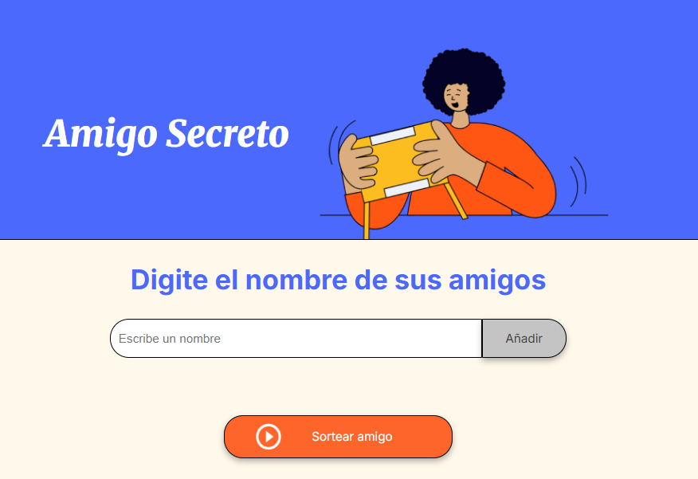
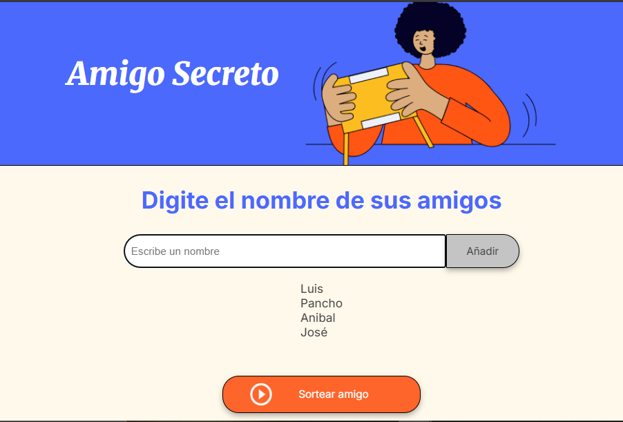

#Challenge_Amigo_Secreto_G8 

Hola! gracias por leer el Readme del Challenge del Amigo Secreto. 

Bueno mi actividad sobre ello es que tendras una página que deberás ingresar amigos para que puedas escoger
a tu amigo secreto para lo que sea desde unas bebidas o quien pone la casa para la parrillada. 

Ingresas los nombres y le das clic en añadir cada uno.   

Deberás ingresar un nombre no intentes agregar algo vacio ya que te dará un aviso 

Cuando ya coloques a tus amigos deberás dar clic en el botón Sortear Amigo Para luego te saldra cual es al amigo secreto seleccionado en este caso será Pancho el seleccionado 

Gracias por tu atención 